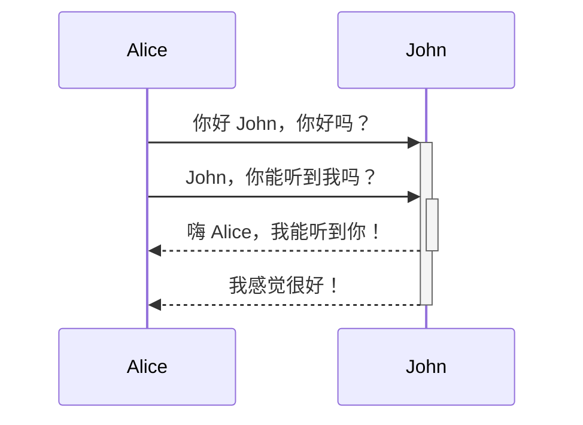

line one  
line two
# 这是一级标题
## 这是二级标题
### 这是三级标题
#### 这是四级标题
###### 这是五级标题
###### 这是六级标题  


**加粗文本**  
*斜体文本*  
~~删除线文本~~  
==高亮文本==  
**加粗文本和*嵌套斜体*文本**  
***加粗和斜体文本***  

[Obsidian 帮助](https://help.obsidian.md)  

  

  

  

> Human beings face ever more complex and urgent problems, and their effectiveness in dealing with these problems is a matter that is critical to the stability and continued progress of society.

\- Doug Engelbart, 1961  


> #### The quarterly results look great!
>
> - Revenue was off the chart.
> - Profits were higher than ever.
>
>  *Everything* is going according to **plan**.

- 第一个列表项
- 第二个列表项
- 第三个列表项

1. 第一个列表项
2. 第二个列表项
3. 第三个列表项

这是一行文字。  
1. 第一个列表
2. 第二个列表

- [x] 这是一个已完成的任务  
- [ ] 这是一个未完成的任务
- [x] 牛奶
- [x] 鸡蛋
- [-] 鸡蛋

1. 第一个列表项
	1. 有序嵌套列表项
2. 第二个列表项
	- 无序嵌套列表项

- [ ] 任务项 1
	- [ ] 子任务 1
- [ ] 任务项 2
	- [ ] 子任务 1

***
****
* * *
---
----
- - -
___
____
_ _ _  

行中 `反引号` 内的文本将被格式化为代码。  
`````
cd ~/Desktop
`````

`````js
function fancyAlert(arg) {
  if(arg) {
    $.facebox({div:'#foo'})
  }
}
`````

```py
print("hello, world")
```

````md
以下是如何创建代码块：
```js
console.log("Hello world")
```
````

`````md
````dataviewjs
dv.paragraph(`
~~~mermaid
graph TD
    A --> B
~~~
`)
````
`````


你也可以使用行内脚注。[^3]

这是一个 %%行内%% 注释。

%%
这是一个块注释。

块注释可以跨多行。
%%

1\. 这不会成为列表项。  

| 姓   | 名   |
| --- | --- |
| 普朗克 | 麦克斯 |
| 玛丽  | 居里  |

| 左对齐文本 | 居中文本 | 右对齐文本 |
| :---- | :--: | ----: |
| 内容    |  内容  |    内容 |



$$
\begin{vmatrix}a & b\\
c & d
\end{vmatrix}=ad-bc
$$

这是一个行内数学表达式 $e^{2i\pi} = 1$。